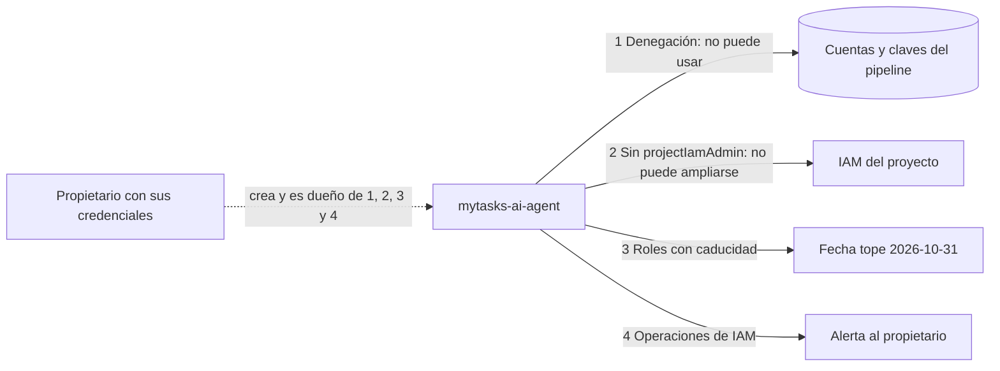

# Contrato de permisos de arranque del agente (resuelve MED-003)

**Feature**: `002-cloud-run-cicd` | **Plan**: [../plan.md](../plan.md) | **Identidad del agente**: [agent-identity.md](./agent-identity.md) | **Origen**: MED-003 de [../security-review-fase-1.md](../security-review-fase-1.md)

Diseño de arquitectura (`mytasks-google-cloud-architect`, 2026-10-06). Define qué puede y qué no puede hacer
`mytasks-ai-agent` durante el arranque de la Fase 3 y cómo se garantiza de forma técnica, no solo por
proceso. No contiene comandos: los ejecuta el propietario o `mytasks-google-cloud-operator` con confirmación
explícita.

## 1. Problema y corrección de la premisa

Los permisos temporales de arranque (RUNBOOK §4) permiten al agente crear las cuentas del pipeline
(`terraform-*`, `terraform-plan-*`, `deployer-*`), que el diseño reserva al pipeline y sin claves (R-5, Principio V).

**Corrección del informe de la Fase 1.** MED-003 afirmaba que `roles/iam.serviceAccountAdmin` incluye la
creación de claves. No es así: `iam.serviceAccountKeys.create` está en `roles/iam.serviceAccountKeyAdmin` y en
`roles/editor`. El vector real es `iam.serviceAccounts.setIamPolicy`, que sí incluye `serviceAccountAdmin` y que,
según la documentación, permite concederse a uno mismo la suplantación de esa cuenta (por ejemplo,
`serviceAccountTokenCreator`). Además, `roles/resourcemanager.projectIamAdmin` permite concederse cualquier rol,
incluido el que gestiona las políticas de denegación. El riesgo y su gravedad no cambian; cambia la remediación.

## 2. Decisión

**Separar «crear» de «usar» y que quien crea los controles sea el propietario, no el agente.** Cuatro capas.

**Revisión 2026-10-09 (decisión del propietario).** Los proyectos **no tienen organización**, y `roles/iam.denyAdmin`
solo se concede en una organización; que Owner incluya `iam.denypolicies.*` no está confirmado. Por eso la **capa 1
pasa a ser opcional y sujeta a prueba** (§4.1). El propietario decidió además que **el agente crea las seis cuentas
del pipeline y sus vinculaciones de federación** (conserva `serviceAccountAdmin`). Sin la capa 1, las capas 2 a 4
**reducen y detectan** el riesgo pero no lo impiden de forma preventiva (§7).

| Capa | Mecanismo | Qué impide |
|---|---|---|
| 1 (opcional, sujeta a prueba) | Política de denegación sobre el agente, a nivel de proyecto | Crear claves o asumir una cuenta de servicio, aunque se conceda el rol a sí mismo: la denegación gana siempre a la concesión |
| 2 | Retirar `roles/resourcemanager.projectIamAdmin` | Concederse roles de proyecto o el rol que administra la denegación |
| 3 | Condición de caducidad en cada rol temporal que queda | Que los permisos sigan valiendo si T060 se retrasa |
| 4 | Alerta por registros de auditoría, propiedad del propietario | Que una operación de IAM del agente pase inadvertida |

## 3. Permisos del agente tras el cambio

El agente sigue pudiendo **crear** las cuentas y enlazarlas a la federación, pero nunca **asumirlas**.

| Rol | `pdlco-mytasks` | `pdlco-mytasks-stg` | Cambio | Caduca |
|---|---|---|---|---|
| `roles/serviceusage.serviceUsageAdmin` | sí | sí | pasa a condicional | 2026-10-31 |
| `roles/iam.serviceAccountAdmin` | sí | sí | pasa a condicional | 2026-10-31 |
| `roles/resourcemanager.projectIamAdmin` | **no** | **no** | **retirado** | — |
| `roles/storage.admin` | sí | no | pasa a condicional | 2026-10-31 |
| `roles/iam.workloadIdentityPoolAdmin` | sí | no | pasa a condicional | 2026-10-31 |
| `roles/artifactregistry.admin` | sí | no | pasa a condicional | 2026-10-31 |
| `roles/viewer`, `roles/logging.viewer` | sí | sí | sin cambio (permanentes; los roles básicos no admiten condiciones) | nunca |

**Qué cubre cada tarea sin `projectIamAdmin`.** Todo lo que el agente hace es a nivel de recurso: T042 (APIs),
T043 (bucket y su IAM), T044 (federación), T046/T047/T049 (crear cuentas y sus vinculaciones de federación, que son
política de la cuenta de servicio), T048 (repositorio y su IAM). **Lo que pasa a ser del propietario** son las
concesiones a nivel de **proyecto** de las cuentas del pipeline (los roles de `terraform-production` y
`terraform-staging` y el visor de `terraform-plan-*`). El diseño de T046 (Ficha 5) entrega la lista exacta de
roles; el propietario la aplica con sus credenciales.

## 4. Especificación de cada control

### 4.1 Política de denegación (una por proyecto)

- **Adjunta a** cada proyecto (`pdlco-mytasks` y `pdlco-mytasks-stg`); hereda a todos sus recursos. Límite de la
  plataforma: 500 políticas de denegación por recurso (corregido; antes decía 5).
- **Principal denegado**: únicamente `mytasks-ai-agent`, con el identificador de principal de cuenta de servicio
  del formato «Principal identifiers for deny policies». **Sin excepciones.**
- **Permisos denegados**: `iam.googleapis.com/serviceAccountKeys.create`, `serviceAccounts.getAccessToken`,
  `serviceAccounts.getOpenIdToken`, `serviceAccounts.implicitDelegation`, `serviceAccounts.signBlob`,
  `serviceAccounts.signJwt` y `serviceAccounts.actAs`. Todos figuran como compatibles con denegación en la
  documentación. `actAs` evita además que el agente adjunte una cuenta a un servicio (Principio VI).
- **Sin condición de nombre.** Las condiciones de denegación solo admiten etiquetas de recurso; no se necesita
  acotar, porque el agente no precisa esos permisos sobre ninguna cuenta.
- **Autoprotección**: si `iam.googleapis.com/denypolicies.*` figura en la lista de permisos compatibles al crearla,
  se añade a la misma regla; si no figura, la protección es la capa 2 (el agente no puede concederse
  `roles/iam.denyAdmin`). Quien la crea comprueba cuál de los dos casos aplica y lo anota en el RUNBOOK.
- **Quién la gestiona**: el propietario. Las políticas de denegación se administran con `roles/iam.denyAdmin`,
  que la documentación pide conceder en la **organización**. **Sin organización es incierto que se pueda crear**:
  T041a es una **prueba de 5 minutos** en un proyecto. Si funciona, se aplica en ambos; si no, se anota en el
  RUNBOOK que la capa 1 no está disponible y se sigue con las capas 2 a 4. No bloquea la Fase 3.

### 4.2 Caducidad de los roles temporales

- Cada rol temporal vuelve a concederse al agente **con condición**: la solicitud debe ser anterior a
  `2026-10-31T23:59:59Z` (atributo de fecha y hora de la solicitud). Es válida para todos los servicios.
- **Orden obligatorio**: primero se añade la concesión condicional y después se retira la incondicional. Una
  concesión condicional **no anula** una incondicional del mismo rol, así que si la antigua se queda, la caducidad
  no tiene efecto.
- Un rol caducado **no se elimina solo**: deja de valer, pero su enlace permanece hasta que T060 lo retira.
- **Renovación**: solo el propietario, de forma explícita y con nueva fecha, anotada en el RUNBOOK.

### 4.3 Alerta (propiedad del propietario)

- **Tipo**: política de alertas basada en registros, sobre los registros de auditoría de **actividad de
  administración** (siempre activos), con un canal de notificación por correo del propietario y un intervalo
  mínimo entre avisos de 5 minutos. Se crea en cada proyecto.
- **Qué detecta**, siempre con el agente como autor: cambios de política de IAM (proyecto, cuentas de servicio,
  bucket, repositorio), creación de cuentas de servicio y de claves, cualquier operación sobre políticas de
  denegación, y cambios en el *pool* o el proveedor de federación. Además, **cualquier intento denegado** por la
  política de la capa 1: es la señal inequívoca de un intento de escalada.
- **Nombres de método**: se fijan contra entradas reales del registro, como se hizo en la comprobación 8 del
  RUNBOOK, antes de crear la política (no se asumen). Lo mismo para saber en qué registro queda un intento denegado.
- **El agente no puede editarla**: no tiene ningún rol de Monitoring de escritura y no se le concede (el vigilado
  no debe poder modificar a su vigilante).

## 5. Orden de ejecución (propietario) y verificación

1. **T041a** (opcional) Probar si el proyecto admite crear la política de denegación; si sí, crearla en ambos (§4.1).
2. **T041b** Sustituir los permisos temporales (§4.2) y retirar `projectIamAdmin`, en ese orden, en ambos proyectos.
3. **T041c** Crear el canal de correo y la política de alertas (§4.3) en ambos proyectos.
4. **T041d** Verificación por el agente (`mytasks-google-cloud-operator`), con confirmación explícita, con una
   cuenta de prueba desechable creada por el agente:

| # | Comprobación | Resultado esperado |
|---|---|---|
| 10 | Crear una clave de la cuenta de prueba | Denegado (por la política de denegación si existe; si no, por falta de permiso: `serviceAccountAdmin` no incluye crear claves) |
| 11 | Solo si existe la capa 1: concederse `serviceAccountTokenCreator` sobre la cuenta de prueba y pedir un token | La concesión se acepta y el uso se **deniega**: la denegación gana. **Sin capa 1 no se ejecuta**: la concesión funcionaría y sería una escalada real |
| 12 | Modificar la política de IAM del proyecto | Denegado (el agente ya no tiene `projectIamAdmin`) |
| 13 | Las operaciones de 10, 11 y 12 | El propietario recibe un aviso en minutos; la cuenta de prueba se borra después |
| 14 | Leer la política de IAM de cada proyecto | Las seis (cinco en staging) concesiones temporales llevan condición de caducidad, sin duplicados incondicionales, y no existe `projectIamAdmin` |

Los resultados se anotan en RUNBOOK §6 y la tabla de §4 del RUNBOOK se actualiza con este contrato.

## 6. Alternativas descartadas

| Alternativa | Por qué no |
|---|---|
| `projectIamAdmin` condicionado a una lista de roles | La lista (máximo 10) no puede incluir roles con `setIamPolicy`, y los roles de las cuentas `terraform-*` los tienen; quedaría una puerta abierta |
| Política de organización «deshabilitar creación de claves» | Choca con la rotación de 90 días de la clave del agente (FR-025); revisar cuando la clave se sustituya |
| Denegación acotada por etiquetas a `terraform-*` | Requiere infraestructura de etiquetas y no protege más: el agente no necesita esos permisos en ninguna cuenta |
| *Principal Access Boundary* | Mecanismo de organización, desproporcionado para este proyecto |
| Quitar también `serviceAccountAdmin` y crear las cuentas el propietario | Era la opción recomendada el 2026-10-06 por la incertidumbre de la capa 1; **el propietario decidió el 2026-10-09 que las crea el agente**, aceptando el riesgo residual de §7 |

## 7. Riesgos residuales aceptados

- **`workloadIdentityPoolAdmin`** permite al agente modificar la condición de confianza de la federación (y, con
  ella, ampliar quién puede asumir las cuentas del pipeline) y **`storage.admin`** el bucket del estado de
  Terraform. T043 y T044 los necesitan. Se mitigan con la caducidad, la alerta de la capa 4 y la confirmación
  explícita de cada cambio; T061 los revisa antes de cerrar la fase.
- **Sin capa 1, el agente puede escalar con `serviceAccountAdmin`**: `setIamPolicy` sobre una cuenta del pipeline le
  permite concederse `serviceAccountTokenCreator` y suplantarla (vector del §1). Ya no es preventivo: lo **detecta**
  la alerta (capa 4, incluye `setiampolicy`) y lo **acota en el tiempo** la caducidad (capa 3). Aceptado por el
  propietario el 2026-10-09; se compensa con confirmación explícita de cada operación y se cierra con T060.
- La **denegación no admite caducidad**: es permanente por diseño. Solo el propietario puede cambiarla.
- La retirada efectiva sigue siendo **T060**; la caducidad es la red de seguridad si se retrasa.

## 8. Documentación consultada

Con el MCP `google-developer-knowledge` (2026-10-06): *Deny policies* (`iam/docs/deny-overview`,
`deny-access`, `deny-permissions-support`), *Configure temporary access* y *IAM Conditions*
(`configuring-temporary-access`, `conditions-overview`, `conditions-attribute-reference`), *Setting limits on
granting roles* (`setting-limits-on-granting-roles`), *Service account best practices* y *Service account
permissions* (`best-practices-service-accounts`, `service-account-permissions`), roles de IAM
(`roles-permissions/iam`) y *Log-based alerting policies* (`logging/docs/alerting/log-based-alerts`).
