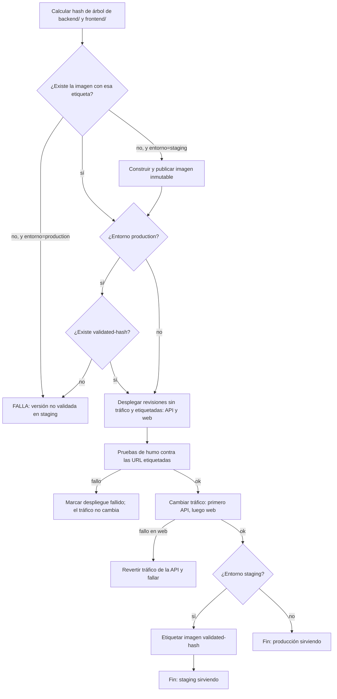

# Contrato del pipeline CI/CD

**Feature**: `002-cloud-run-cicd` | **Plan**: [../plan.md](../plan.md)

Contrato de comportamiento de los workflows de GitHub Actions: qué se dispara, qué hace cada
job, qué puertas existen y qué nombres exponen los *checks*. No contiene la implementación del
workflow.

## Workflows

| Workflow | Disparador | Puede desplegar | Entorno de GitHub |
|---|---|---|---|
| `ci.yml` | `pull_request` a `develop`, `main`, `release/*`, `hotfix/*`; también reutilizable (`workflow_call`) | No | — |
| `deploy.yml` | `workflow_call` (lo invocan los dos siguientes) | Sí | el de quien lo llama |
| `deploy-staging.yml` | `push` a `develop`, `release/*`, `hotfix/*` | Sí, solo staging | `staging` |
| `deploy-production.yml` | `push` a `main` | Sí, solo producción | `production` |
| `infra.yml` | `pull_request` (plan; el job se omite sin cambios en `infra/**`); `push` a `develop`/`main` con cambios en `infra/**` (apply) | Solo infraestructura | `infra-staging`, `infra-production` |

Los despliegues y `infra.yml` solo corren para el repositorio propio (no para *forks*).
Las PR nunca acceden a identidades de despliegue ni de escritura; la única identidad de Google
Cloud que una PR del repositorio propio puede alcanzar es `terraform-plan-<env>`, de solo
lectura, para el `plan` de `terraform-validate`.

## Checks requeridos (nombres estables)

Estos nombres se configuran como *required status checks* en los rulesets de `main`, `develop`,
`release/*` y `hotfix/*` (Principios II y VII):

| Check | Contenido | Nivel (Principio II) |
|---|---|---|
| `backend-lint-types` | `ruff` (lint y formato) y `mypy` estricto | calidad |
| `backend-tests` | `pytest`: unitarios e integración contra los emuladores de Firestore y Auth | unitario + integración |
| `frontend-lint-types` | ESLint, Prettier, `tsc` | calidad |
| `frontend-tests` | Vitest | unitario |
| `e2e` | Playwright contra frontend, API y emuladores | e2e |
| `images-build` | construye las dos imágenes sin publicar: la API con `pack build` (Buildpacks) y la web con su Dockerfile (detecta empaquetados rotos) | despliegue |
| `secrets-scan` | análisis de secretos en el historial del cambio | seguridad |
| `api-contract-compat` | genera el contrato OpenAPI de la API de la PR y el de su rama destino y falla ante un cambio incompatible (FR-008) | contrato |
| `terraform-validate` | `fmt`, `validate` y `plan` de las raíces afectadas (sin aplicar); si no hay cambios en `infra/**`, termina como omitido | infraestructura |

**Los checks requeridos se ejecutan siempre.** Ningún workflow que los produzca puede llevar un
filtro `paths` a nivel de workflow: en una PR sin cambios en esas rutas el check quedaría
*pendiente* y bloquearía la fusión. La omisión se decide dentro del job (condición `if` sobre los
ficheros cambiados): un job omitido cuenta como superado. Esto aplica sobre todo a
`terraform-validate`, que produce `infra.yml`: su disparador en PR es cualquier `pull_request`
(sin filtro `paths`) y el job se omite si no hay cambios en `infra/**`. El filtro por rutas solo
se admite en los disparadores `push` de `infra.yml`, cuyos checks no son requeridos.

FR-004: `deploy.yml` invoca `ci.yml` y **no despliega** si algún job falla.

## Flujo de `deploy.yml`

### Pasos y puertas

1. **Identificación**: hash de árbol de `backend/` y de `frontend/` (independientes).
2. **Construcción** (solo staging y solo si falta la imagen): publica `mytasks-api:<hash>` y
   `mytasks-web:<hash>` con etiquetas inmutables. La API se construye con `pack build --publish`
   (builder de Google Cloud fijado por digest o versión, sin `latest`, y leído de `backend/` para que cambiarlo cambie el hash) y la web con su
   Dockerfile; ambas en el runner, sin Cloud Build. Ninguna variable de entorno se incrusta en la
   imagen.
3. **Promoción** (producción): exige `validated-<hash>` de ambos componentes; si falta, el job
   falla antes de tocar nada (mensaje: qué componente y qué hash).
4. **Revisión sin tráfico**: cada servicio recibe una revisión nueva con etiquetas de
   `commit`, `tree-hash` y `pipeline-run` y las variables del entorno (`APP_VERSION`,
   `APP_ENV`, `CORS_ORIGINS`, URL de la API, configuración pública de Firebase). Si falta una
   variable obligatoria, el job falla aquí con un mensaje que nombra lo que falta (edge case
   de la spec).
5. **Humo** (todas obligatorias):
   - API `/healthz` → `200` con `version` = versión esperada.
   - API `/readyz` → `200` (Firestore accesible con la identidad de ejecución).
   - API endpoint de datos sin token → `401` (no es anónimo).
   - Web `/` → `200`; `/config.js` contiene la URL de la API del entorno y no la de otro.
6. **Cambio de tráfico**: 100 % a las revisiones nuevas, primero API y después web. Si falla el
   de web, la API vuelve a su revisión anterior.
7. **Validación** (solo staging): añade `validated-<hash>` a ambas imágenes.
8. **Registro** (FR-017): el despliegue queda en GitHub (commit, rama, resultado, URL) y en las
   etiquetas de la revisión.

### Concurrencia (FR-019)

Un grupo de concurrencia por entorno (`deploy-staging`, `deploy-production`) **sin cancelar** la
ejecución en curso: la que está desplegando termina, y de las pendientes solo se conserva la más
reciente. Resultado: nunca dos despliegues a la vez y queda desplegada la última versión.

El grupo de staging es común a `develop`, `release/*` y `hotfix/*`: "la más reciente" se aplica a
todas las ramas, de modo que una fusión posterior en `develop` puede sustituir en staging una
`release/*` que se estaba validando. Es deliberado (un único staging, sin entornos efímeros); el
propietario evita fusionar en `develop` mientras valida una release.

## Flujo de `infra.yml`

- **PR con cambios en `infra/**`**: `terraform fmt`, `validate` y `plan` de las raíces
  afectadas; el plan se publica en la PR (sin secretos). No aplica nada. Se autentica con la
  identidad de solo lectura `terraform-plan-<env>` (federación al evento `pull_request` del
  repositorio propio; los *forks* no tienen acceso).
- **Push a `develop`** aplica la raíz `staging` (`infra-staging`, identidad `terraform-staging`);
  **push a `main`** aplica las raíces `production` y `platform` (`infra-production`, identidad
  `terraform-production`). La plataforma vive en el proyecto de producción, así que ningún flujo
  de `develop` puede tocarla. Un cambio de plataforma que staging necesite llega antes por
  `release/*` → `main`. Cada apply está detrás del *environment* de GitHub con **aprobación
  obligatoria del propietario** (FR-020).
- El plan que se aplica es el mismo que se mostró para aprobar (se guarda como artefacto del
  workflow).

## Interacción entre despliegue de aplicación e infraestructura

Una misma fusión puede tocar código de aplicación e `infra/**`; entonces corren `deploy-*.yml` e
`infra.yml` a la vez. Reglas (repositorio único; research R14):

- **Sin grupo de concurrencia compartido.** Un grupo compartido y sin cancelar conserva solo la
  ejecución pendiente más reciente: podría descartar un `apply` o un despliegue. Cada workflow
  mantiene su propio grupo (`deploy-<entorno>`, `infra-<entorno>`).
- **Serialización de Terraform por el bloqueo del estado**: dos `apply` de la misma raíz no
  pueden coincidir.
- **Sin conflicto de propiedad**: Terraform ignora la imagen y el tráfico de los servicios
  (Ficha 6) y el pipeline de aplicación no toca nada más que revisiones y tráfico.
- **Variables obligatorias**: si el despliegue necesita una variable que aún no aplicó Terraform,
  falla en el paso de revisión sin tráfico con un mensaje que la nombra (edge case de la spec);
  basta con relanzar el despliegue tras el `apply`. Un cambio de contrato de variables se hace
  en dos PR consecutivas (primero infra, después aplicación), nunca en una sola fusión.
- **Protección contra borrado**: Firestore y los servicios de Cloud Run llevan
  `deletion_protection`; estado, registro y federación, `prevent_destroy`. Un `apply` no puede
  destruirlos sin una PR previa que retire la protección.

## Seguridad del pipeline (Principio III y VI)

- Autenticación en Google Cloud solo por federación de identidad (OIDC); **sin claves** en
  secretos de GitHub (FR-013).
- Permisos del token del workflow: por defecto solo lectura del contenido; `id-token: write` solo
  en los jobs que se autentican.
- Acciones de terceros fijadas por SHA completo; actualización planificada.
- Cada *environment* limita las ramas que pueden usarlo: `staging` solo a `develop`, `release/*`
  y `hotfix/*`; `production` solo a `main`. La condición de la federación de identidad exige
  además el repositorio propio (por identificador numérico) y el entorno correspondiente
  (research R3).
- Ningún workflow imprime valores de configuración sensibles; los planes de Terraform publicados
  en PR no contienen secretos (no hay secretos en el estado; research R8).

## Notificaciones y estado (FR-017, FR-018, US4)

- Fallo de cualquier workflow → notificación nativa de GitHub al propietario (correo y móvil),
  configurada en su cuenta y verificada según [../quickstart.md](../quickstart.md).
- El estado por entorno se consulta en la pestaña *Environments* del repositorio (versión y
  resultado) y en `/healthz` de cada API (campo `version`).
