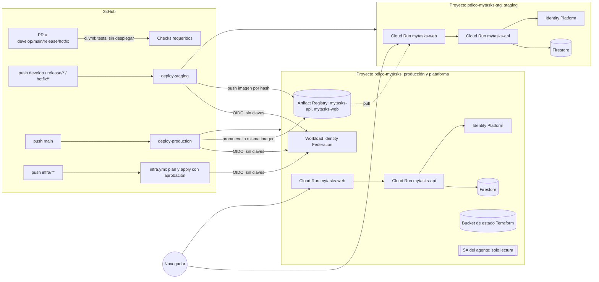

# Implementation Plan: Infraestructura en Google Cloud y pipeline CI/CD

**Branch**: `feature/002-cloud-run-cicd` | **Date**: 2026-09-29 | **Spec**: [spec.md](./spec.md)

**Input**: Feature specification from `specs/002-cloud-run-cicd/spec.md`

**Rol de diseño**: este plan lo elabora `mytasks-google-cloud-architect` (Principio VIII). Solo
contiene decisiones de diseño, contratos y fichas de implementación; no incluye código, IaC ni
comandos. La documentación de Google Cloud se consultó con el MCP `google-developer-knowledge`
(ver [research.md](./research.md), sección *Documentación consultada*).

## Summary

Desplegar la aplicación de la feature 001 (SPA React + API FastAPI + Firestore + Firebase Auth)
en Google Cloud, con **dos servicios de Cloud Run por entorno** (`mytasks-web` y `mytasks-api`) y
dos entornos aislados, **staging** y **producción**, cada uno en su propio proyecto de Google
Cloud (producción comparte proyecto con la plataforma: registro de imágenes, federación de
identidad y estado de Terraform). Un pipeline de GitHub Actions es la única vía de despliegue: valida con los tres niveles
de tests, construye una imagen inmutable por componente (con **Buildpacks de Google Cloud** por
defecto; Dockerfile solo como excepción justificada, ver research R13), la despliega en staging y, cuando el
cambio llega a `main`, **promueve la misma imagen** a producción. El despliegue es en dos pasos
(revisión sin tráfico → comprobación de salud → cambio de tráfico) para que un fallo nunca
sustituya la versión que sirve a los usuarios.

Toda la infraestructura se define en Terraform y se aplica **también desde el pipeline**, con
aprobación del propietario. Además, esta feature migra el MCP de Google Cloud a un **almacén de
credenciales aislado** con la identidad del propio agente, de modo que el uso de credenciales
personales sea técnicamente imposible y no solo una instrucción (FR-022 a FR-025; diseño en
[contracts/agent-identity.md](./contracts/agent-identity.md)).



## Technical Context

**Language/Version**: sin código de aplicación nuevo salvo cambios mínimos de despliegue
(Python 3.13 backend, subido desde 3.12 para el soporte GA de `pyproject.toml` en los Buildpacks;
TypeScript 5.x frontend). Terraform (proveedores `google` y `google-beta`), GitHub Actions,
contenedores Linux.

**Primary Dependencies**: Cloud Run, Artifact Registry, Firestore (modo nativo), Identity
Platform / Firebase Auth, IAM y Workload Identity Federation, Secret Manager (reservado, ver
research R8), Cloud Logging. Imágenes: Buildpacks de Google Cloud para la API (`pack` en
GitHub Actions, sin Cloud Build) y Dockerfile con Nginx sin privilegios para la web (research R13).

**Storage**: Firestore nativo, una base de datos por entorno (cada uno en su proyecto); política TTL sobre
`purge_at` (colección `tasks`) e índices de `firestore.indexes.json`, ambos por Terraform.
Estado de Terraform en un bucket de GCS versionado del proyecto de producción (plataforma).

**Testing**: los tres niveles de la constitución ya existentes (pytest unitario e integración
contra emuladores, Vitest, Playwright) ejecutados en CI. Nuevos: pruebas de humo tras cada
despliegue (salud, versión, no-anonimato de la API) y la prueba repetible de identidad del agente
([quickstart.md](./quickstart.md)).

**Target Platform**: Google Cloud, región `europe-southwest1` (Madrid) para Cloud Run, Firestore
y Artifact Registry.

**Project Type**: infraestructura y pipeline para una aplicación web existente (frontend SPA +
API).

**Performance Goals**: SC-001/SC-002: nueva versión en staging/producción en < 15 min desde la
fusión (p95 de ejecuciones 95 %). Sin objetivo de latencia nuevo (heredado de la feature 001).

**Constraints**: solo Google Cloud; despliegue solo por pipeline; el agente solo opera por el
MCP con su cuenta de servicio y credenciales aisladas; sin secretos en el repo; sin claves de
larga duración en el pipeline; Terraform nunca se aplica desde la máquina del propietario ni del
agente.

**Scale/Scope**: uso personal (decenas de usuarios). Dos entornos, dos proyectos de Google Cloud,
cuatro servicios de Cloud Run, cinco workflows de GitHub Actions.

**Coste estimado** (orden de magnitud, ver [research.md](./research.md) R11): ≈ 0–5 USD/mes por
entorno con escala a cero, dentro de la capa gratuita de Cloud Run en el uso previsto.

No quedan puntos marcados como NEEDS CLARIFICATION: se resolvieron en
[research.md](./research.md). Las decisiones que requieren ratificación del propietario están
en la sección *Decisiones para el propietario*.

## Constitution Check

*GATE: Must pass before Phase 0 research. Re-check after Phase 1 design.*

| Principio | Cómo lo cumple este plan | Estado |
|---|---|---|
| **I. Simplicidad** | Sin balanceador, VPC, Cloud Armor, Cloud Build, Cloud Deploy, Pub/Sub ni dominio propio; URL nativas de Cloud Run. Un solo mecanismo de CI (GitHub Actions) para tests, despliegue e infraestructura. Empaquetado con Buildpacks por defecto (menos ficheros que mantener); el único Dockerfile se justifica en *Complexity Tracking*. Cada adición no trivial se justifica en *Complexity Tracking*. | ✅ |
| **II. Tests por niveles** | El pipeline ejecuta los tres niveles como *required checks* (FR-004/FR-005). Las piezas nuevas de código (endpoint de disponibilidad, configuración en tiempo de ejecución del frontend) llevan sus tests unitarios/integración; el flujo de despliegue se valida con pruebas de humo y con [quickstart.md](./quickstart.md). El e2e de Playwright existente cubre los flujos de usuario; esta feature no añade flujos de usuario. | ✅ |
| **III. Seguridad** | Auth de aplicación intacta (API autenticada; `/healthz` y `/readyz` anónimos sin datos). Sin secretos en el repo; el pipeline usa federación de identidad sin claves; identidades de ejecución con mínimo privilegio (`roles/datastore.user` solo la API). Lockfiles y acciones de GitHub fijadas por SHA. **Revisión `mytasks-security-auditor` obligatoria**: la feature define identidades, permisos, IAM y la custodia de una clave (Fase 1 y antes de fusionar la última PR). | ✅ (revisión pendiente, planificada) |
| **IV. Paridad de entornos** | Un único módulo de Terraform instancia staging y producción; solo difieren dimensionado y valores de entorno. La misma imagen se promueve de staging a producción. `release/*` y `hotfix/*` se validan en staging antes de llegar a `main` (ver research R5). Local sigue siendo el único entorno de pruebas manuales. | ✅ con la misma enmienda 1.3.0 (T006a): el Principio IV admite `release/*` y `hotfix/*` como orígenes de staging |
| **V. Identidad de agente / MCP (NON-NEGOTIABLE)** | Fase 1 sustituye la suplantación actual por un almacén aislado con la clave de la cuenta de servicio del agente, bloqueo de las credenciales personales y hook de identidad (FR-022–FR-025). Tras el arranque inicial el agente solo tiene permisos de **lectura** en ambos proyectos: los cambios los aplica el pipeline. El MCP es la única vía del agente; Terraform no se ejecuta con credenciales del agente. | ✅ con la enmienda 1.3.0 de la constitución ratificada antes de la Fase 3 (T006a: el Principio V aplica al agente y las cuentas del pipeline quedan fuera de la restricción de identidad del agente) y una vez completada la Fase 1; ver riesgo R-1 |
| **VI. Despliegue por pipeline (NON-NEGOTIABLE)** | Solo las identidades de despliegue del pipeline tienen permisos de escritura sobre Cloud Run e infraestructura; ni el agente ni el propietario con credenciales personales los usan. Hotfixes: `hotfix/*` → `main` → pipeline. | ✅ |
| **VII. Revisión humana** | Una PR de diseño y una PR por fase; el propietario fusiona. Los *required status checks* de CI se activan en los rulesets (mecanismo hoy *pendiente* en la constitución). Producción solo se despliega al fusionar en `main` (acto humano). `infra.yml` exige aprobación del propietario antes de aplicar. | ✅ |
| **VIII. Agentes y skills** | Diseño: `mytasks-google-cloud-architect`. IaC: `mytasks-iac-developer`. Cambios de app: `mytasks-backend-developer` y `mytasks-frontend-developer`. Operación real (bootstrap): `mytasks-google-cloud-operator`. Seguridad: `mytasks-security-auditor`. Ajustes de `settings.json`/hooks de Claude Code: skill `update-config` (no es de rol; se justifica en la PR). Workflows de GitHub Actions: **ningún skill los cubre** (`mytasks-iac-developer` es Terraform/Pulumi) → se hacen manualmente y se justifica en la PR, o el propietario indica el skill. | ✅ (excepción justificada) |
| **IX. Idioma** | Código, comentarios de Terraform/workflows y commits en inglés (Conventional Commits); documentación, runbook y PRs en español. | ✅ |

**Resultado (antes de la Fase 0)**: PASS. **Revisión tras la Fase 1**: PASS, con dos puntos a
vigilar que se trasladan a *Riesgos*: el bloqueo de creación de claves por políticas de la
organización (R-1) y la configuración manual única del proveedor de Google (R-2).

## Project Structure

### Documentation (this feature)

```text
specs/002-cloud-run-cicd/
├── plan.md                    # Este fichero
├── research.md                # Fase 0: decisiones (ADR), alternativas y documentación consultada
├── data-model.md              # Fase 1: entidades de la spec → recursos concretos y nombres
├── quickstart.md              # Fase 1: guía de validación de extremo a extremo
├── contracts/
│   ├── pipeline.md            # Fase 1: workflows, disparadores, jobs, checks y puertas
│   ├── environments.md        # Fase 1: matriz de entornos, variables, identidades e IAM
│   ├── agent-identity.md      # Fase 1: identidad aislada del agente (FR-022 a FR-025)
│   └── implementation-cards.md  # Fase 1: fichas de implementación por agente/skill
├── checklists/
│   └── requirements.md
└── tasks.md                   # Fase 2 (/speckit-tasks; no lo crea este comando)
```

### Source Code (repository root)

```text
backend/
├── project.toml                # NUEVO: configuración de Buildpacks (GOOGLE_ENTRYPOINT con Uvicorn en 8080, builder fijado dentro de backend/); sin Dockerfile
├── scripts/export_openapi.py   # NUEVO: vuelca el contrato OpenAPI para el check api-contract-compat
├── pyproject.toml              # requires-python y target de ruff/mypy pasan a 3.13
└── src/mytasks_api/
    ├── config.py               # + APP_VERSION (solo lectura desde el entorno)
    └── factory.py              # + GET /readyz (lectura mínima de Firestore) y versión en /healthz

frontend/
├── Dockerfile                  # NUEVO: build de Vite + Nginx sin privilegios, puerto 8080 (excepción a Buildpacks, research R13)
├── .dockerignore               # NUEVO
├── nginx/                      # NUEVO: config SPA (fallback a index.html, cabeceras de seguridad, caché)
│   └── docker-entrypoint.d/    #   NUEVO: genera /config.js con la configuración de runtime al arrancar
├── public/config.js            # NUEVO: valores por defecto para desarrollo local
├── index.html                  # + carga de /config.js antes del bundle
└── src/lib/
    ├── runtimeConfig.ts        # NUEVO: lee window.__APP_CONFIG__ con respaldo a import.meta.env
    ├── firebase.ts             # usa runtimeConfig en vez de import.meta.env (mismo comportamiento local)
    └── apiClient.ts            # ídem para la URL de la API

.github/
└── workflows/
    ├── ci.yml                  # NUEVO: tests y validaciones (PR y reutilizable); sin despliegue
    ├── deploy.yml              # NUEVO: reutilizable: build/promoción → revisión sin tráfico → humo → tráfico
    ├── deploy-staging.yml      # NUEVO: push a develop, release/*, hotfix/*
    ├── deploy-production.yml   # NUEVO: push a main
    └── infra.yml               # NUEVO: terraform fmt/validate/plan en PR; apply con aprobación

infra/                          # NUEVO (Terraform; docs/ está en .gitignore, por eso la doc va aquí)
├── README.md                   # Visión general y cómo se aplica (siempre vía pipeline)
├── RUNBOOK.md                  # Arranque único, configuración manual de Google sign-in, rotación de clave, recuperación
├── platform/                   # Plataforma (en el proyecto de producción): WIF, Artifact Registry, estado, identidades del pipeline
├── modules/environment/        # Módulo único de entorno: APIs, Firestore, TTL, índices, Identity Platform, Cloud Run, IAM
└── envs/
    ├── staging/                # Instancia el módulo con valores de staging
    └── production/             # Instancia el módulo con valores de producción

.mcp.json                       # NUEVO: servidor MCP de Google Cloud con credenciales aisladas (sin secretos)
.claude/
├── settings.json               # + denegaciones de lectura de credenciales, sandbox y registro del hook
└── hooks/                      # NUEVO: guardia de identidad del MCP de Google Cloud
```

**Structure Decision**: se mantienen `backend/` y `frontend/` independientes, se añade `infra/`
con un módulo de entorno reutilizado por dos raíces (paridad de entornos, Principio IV) y una raíz
`platform/` (en el proyecto de producción) para lo que ambos entornos comparten (registro de imágenes, federación de identidad y
estado). Los workflows viven en `.github/workflows/`. La documentación operativa va en `infra/`
porque `docs/` está excluido del repositorio salvo `docs/design/`.

## Fases de implementación (orientativas para `/speckit-tasks`)

Cada fase se entrega en su propia rama y PR a `develop` (Principio VII). Las fases 3 en adelante
requieren operaciones reales sobre Google Cloud y **no pueden empezar hasta completar la Fase 1**.

| Fase | Contenido | Historia | Agente/skill |
|---|---|---|---|
| **0. Requisitos del propietario** (no es código) | Crear el proyecto `pdlco-mytasks-stg` (nombre provisional) y vincular facturación (producción usa el `pdlco-mytasks` existente); decidir si la organización permite claves de cuenta de servicio; crear la clave de `mytasks-ai-agent` y guardarla fuera del repo; conceder permisos temporales de arranque a la cuenta del agente | — | Propietario |
| **1. Identidad aislada del agente** | Almacén de credenciales aislado, `.mcp.json`, retirada del servidor con suplantación, denegaciones de lectura, sandbox, hook de identidad, prueba repetible (FR-022–FR-025) | US3 | `mytasks-google-cloud-operator` + `update-config` + revisión `mytasks-security-auditor` |
| **2. Aplicación desplegable y CI** | Empaquetado de la API con Buildpacks (y subida a Python 3.13), Dockerfile del frontend, configuración en runtime del frontend, `/readyz` y versión, `ci.yml` con los checks requeridos | US1/US2 (base) | `mytasks-backend-developer`, `mytasks-frontend-developer`, manual (workflows) |
| **3. Arranque y plataforma** | Arranque vía MCP de todo lo que staging necesita antes de la primera release (bucket de estado, federación, identidades `terraform-*` y `terraform-plan-*`, Artifact Registry, cuentas `deployer-*` y sus permisos), código de `infra/platform` (adopta lo creado), `infra.yml` | US3 | `mytasks-iac-developer`, `mytasks-google-cloud-operator` |
| **4. Staging y despliegue automático** | Módulo de entorno, raíz `staging`, `deploy.yml`, `deploy-staging.yml`, pruebas de humo | US1 | `mytasks-iac-developer`, manual (workflows), `mytasks-google-cloud-operator` |
| **5. Producción y promoción** | Raíz `production`, `deploy-production.yml` con promoción de imagen validada, rulesets con checks requeridos | US2 | ídem |
| **6. Aislamiento, visibilidad y documentación** | Verificación de aislamiento, versión visible, notificaciones, presupuestos, `infra/README.md` y `RUNBOOK.md`, revisión de seguridad final | US3/US4 | `mytasks-iac-developer`, `mytasks-security-auditor` |

Orden de dependencias: 0 → 1 → (2 en paralelo con 1) → 3 → 4 → 5 → 6. La Fase 2 no toca Google
Cloud y puede avanzar mientras se completa la Fase 1.

## Riesgos y limitaciones conocidas

- **R-1 · Creación de claves de cuenta de servicio**: las organizaciones de Google Cloud
  recientes bloquean por defecto la creación de claves (política de organización). Si aplica,
  FR-025 no es viable tal cual y habría que revisar la decisión de la clarificación. El
  propietario debe comprobarlo en la Fase 0.
- **R-2 · Proveedor de Google en Identity Platform**: la pantalla de consentimiento OAuth y la
  creación del cliente OAuth no son automatizables con la documentación consultada. Se documenta
  como paso manual único por entorno en `RUNBOOK.md`; el resto (dominios autorizados, TTL,
  índices) va por Terraform.
- **R-3 · Atomicidad frontend/API**: dos servicios no se pueden conmutar de forma atómica. Se
  mitiga cambiando primero el tráfico de la API y después el del frontend, y exigiendo cambios de
  contrato compatibles hacia atrás durante una versión (research R6).
- **R-4 · API pública**: la API y el frontend admiten invocación anónima a nivel de plataforma
  (los datos exigen token a nivel de aplicación). Se limitan las instancias máximas y se añaden
  alertas de presupuesto; una política de organización que prohíba `allUsers` lo impediría.
- **R-5 · Identidad de infraestructura con permisos amplios**: la identidad que aplica Terraform
  puede administrar IAM del proyecto. Se acota por entorno de GitHub con aprobación del
  propietario, ramas permitidas y revisión de seguridad.
- **R-6 · Comportamiento no verificado del MCP `gcloud-mcp`**: no se ha comprobado si bloquea por
  sí mismo `--impersonate-service-account`, `--account` o `gcloud auth`. El diseño no depende de
  ello (las credenciales personales no existen en su almacén), pero la prueba de la Fase 1 debe
  verificarlo.

- **R-7 · Producción y plataforma en el mismo proyecto**: la federación de identidad, el registro de
  imágenes, el estado de Terraform y la cuenta del agente conviven con los datos de producción, lo
  que se aparta de la recomendación de tener un proyecto dedicado a los *pools* de identidad. Se
  mitiga administrando esos recursos solo por Terraform con aprobación, sin permisos de
  administración del *pool* para nadie más, con la cuenta del agente en solo lectura y con revisión
  de `mytasks-security-auditor`. Staging (menos protegido) solo puede leer imágenes y publicar en
  el repositorio, nunca tocar los servicios ni los datos de producción.
- **R-9 · Radio de daño de un mismo repositorio**: una fusión puede tocar aplicación e
  infraestructura a la vez, y un `apply` erróneo podría destruir datos o la plataforma. Se mitiga
  con protección contra borrado, plan aprobado por el propietario, identidades separadas,
  checks requeridos siempre presentes y el contrato de interacción de
  [contracts/pipeline.md](./contracts/pipeline.md) (research R14).
- **R-10 · Identidad de `plan` alcanzable desde una PR**: `terraform-plan-<env>` es de solo
  lectura, pero una PR con código de workflow propio podría leer el estado y la configuración del
  proyecto. Se acota a PR del repositorio propio (no *forks*), sin permisos de escritura ni IAM, y
  el estado no contiene secretos (research R8). Se revisa en la Fase 3 y en la revisión de seguridad.
- **R-8 · Comportamiento de los Buildpacks no verificado**: la documentación consultada no
  confirma que el builder instale solo dependencias de producción desde `uv.lock`, cómo se fija la
  versión de Python, que la imagen final corra sin privilegios ni la repetibilidad de las
  construcciones. Se comprueba en la Fase 2 (lista en research R13); si alguna falla sin remedio,
  la API vuelve a un Dockerfile justificado en *Complexity Tracking*.

## Decisiones para el propietario

Estas decisiones las propone el arquitecto y necesitan tu ratificación antes o durante la
implementación:

1. **Dos proyectos** (decidido por el propietario el 2026-09-29): `pdlco-mytasks` (ya existe) aloja
   **producción y la plataforma** compartida, y `pdlco-mytasks-stg` (nombre provisional, por
   crear) aloja solo staging.
2. **Región** `europe-southwest1` (Madrid) para todo.
3. **Terraform se aplica siempre desde el pipeline** con tu aprobación; ni tú ni el agente lo
   ejecutáis en local con credenciales.
4. **Staging también se despliega desde `release/*` y `hotfix/*`** (no solo `develop`), para que lo
   que llega a `main` ya se haya validado en staging (Principio IV). Esto amplía FR-002; conviene
   ajustar la spec.
5. **Clave de la cuenta del agente** creada por ti una sola vez con tus credenciales (acto de
   administración humano, no del agente) y guardada fuera del repo.
6. **Configuración manual única** del proveedor de Google (R-2) en cada entorno.
7. **Buildpacks por defecto** (decidido por el propietario el 2026-09-30): la API se empaqueta con
   Buildpacks de Google Cloud y **sube a Python 3.13**; el frontend conserva Dockerfile como
   excepción justificada (research R13).
8. **Repositorio único** (decidido por el propietario el 2026-09-30): aplicación e infraestructura
   siguen juntas, con salvaguardas (protección contra borrado, checks que siempre se ejecutan,
   reglas de interacción en el contrato del pipeline). Se reabre si se cumple alguno de los
   disparadores de research R14.
9. **`plan` de Terraform en PR con identidad de solo lectura** (decidido por el propietario el
   2026-09-30): `terraform-plan-<env>`, federada al evento `pull_request` (research R3, R-10).
10. **Compatibilidad del contrato hacia atrás hecha cumplir en CI** (decidido el 2026-09-30): nuevo
    check `api-contract-compat` (FR-008, research R6).
11. **Enmienda de la constitución** (vía `/speckit-constitution`, ratificada por ti). Los puntos (a)
    y (b) y la aclaración de la restricción de "Identidad en la nube" (las cuentas `terraform-*`,
    `terraform-plan-*` y `deployer-*` son del pipeline) se ratifican **antes de la Fase 3** (T006a);
    el punto (c) se hace al final (T091). Cubre:
    (a) aclarar que el Principio V aplica al agente, pues el pipeline usa Terraform y despliega
    con sus propias identidades; (b) aclarar que el Principio IV admite `release/*` y `hotfix/*`
    como orígenes de staging; y (c) pasar a *activo* los mecanismos de "Sin credenciales
    personales", "Despliegue solo vía pipeline", "Checks de CI" y "Tests por niveles" cuando se
    implementen.

## Complexity Tracking

> Justificaciones exigidas por el Principio I para cada pieza que no es la solución mínima.

| Adición | Por qué se necesita | Alternativa más simple rechazada porque |
|---|---|---|
| Dos proyectos de Google Cloud (producción + plataforma, y staging) | Aislamiento real de usuarios, datos e identidades entre producción y pruebas (FR-009, SC-009); el registro, la federación y el estado viven junto a producción para no crear un tercer proyecto | Un solo proyecto: la autenticación (una base de usuarios por proyecto, tokens válidos en todo el proyecto), la cuota gratuita de Firestore (una sola base de datos) y el IAM de datos quedarían compartidos. Tres proyectos: un proyecto más que crear y mantener sin un beneficio proporcional para uso personal (decisión del propietario) |
| Terraform aplicado desde el pipeline | FR-011 (reproducible) y FR-020/Principio V: el agente no puede ejecutar Terraform sin acceso a la clave que FR-023 le oculta | `terraform apply` en local: exige credenciales en la máquina del propietario o del agente, contra los Principios V y VI |
| Federación de identidad de GitHub (sin claves) | FR-013: el pipeline no puede guardar claves de larga duración | Clave de cuenta de servicio en un secreto de GitHub: credencial de larga duración exfiltrable |
| Imagen inmutable identificada por el hash del contenido, promovida de staging a producción | FR-006/Principio IV: producción ejecuta exactamente lo validado en staging | Reconstruir en `main`: distinto artefacto (dependencias, hora, entorno de build) que el validado |
| Configuración del frontend en tiempo de ejecución (`/config.js`) | La imagen debe ser idéntica en ambos entornos (FR-006), pero Vite fija `VITE_*` en la compilación | Compilar una imagen por entorno: rompe la promoción del mismo artefacto |
| `/readyz` (lectura mínima de Firestore) y versión en `/healthz` | FR-016 y US4: detectar un despliegue con permisos o base de datos rotos y saber qué versión sirve cada entorno | Comprobar solo `/healthz` (proceso vivo): un servicio sin acceso a Firestore pasaría la prueba de humo |
| Despliegue en dos pasos (sin tráfico → humo → tráfico) | FR-007/FR-008: un fallo no sustituye la versión activa y se conmuta primero la API, luego el frontend | Despliegue directo con 100 % de tráfico: la comprobación llega después de servir a usuarios |
| Almacén de credenciales aislado, `.mcp.json`, hook de identidad | Petición explícita del propietario y FR-022–FR-025: "técnicamente imposible" | Instrucción al LLM o solo regla `deny` de Bash: no impide leer credenciales personales ni usar un SDK |
| Identidades separadas: despliegue de app vs. infraestructura | Mínimo privilegio: el despliegue no necesita administrar IAM | Una sola identidad con permisos amplios: cualquier fallo del pipeline de aplicación podría cambiar IAM |
| Protección contra borrado (`deletion_protection`, `prevent_destroy`) | Un `apply` no puede destruir datos ni plataforma sin una PR previa que la retire (R-9) | Confiar solo en la aprobación del plan: un `destroy` escondido en un plan largo podría aprobarse por error |
| Identidades `terraform-plan-<env>` de solo lectura | Mostrar el `plan` en la PR antes de fusionar sin dar a las PR una identidad de escritura | Plan solo tras la fusión: no se ve el efecto del cambio hasta que ya está integrado |
| Check `api-contract-compat` | Hacer cumplir FR-008 (API primero, compatible hacia atrás) en lugar de confiar en la disciplina | Convención sin verificación: un cambio incompatible llegaría a staging y dejaría una ventana incoherente |
| Dockerfile del frontend (excepción a Buildpacks) | El buildpack de Node elimina las `devDependencies` y arranca un proceso Node; no sirve una SPA estática con `/config.js` en runtime (FR-006/FR-014) | Buildpack de Node con servidor propio: más código y superficie que mantener que un Nginx sin privilegios |
| `pack` en GitHub Actions en vez de Cloud Build / `gcloud run deploy --source` | Construir Buildpacks sin añadir Cloud Build (Principio I) y promover el artefacto ya validado en vez de reconstruir (FR-006) | `--source`: requiere Cloud Build y reconstruye en cada despliegue |
| Artifact Registry con etiquetas inmutables | Impedir que una etiqueta validada apunte luego a otra imagen | Etiquetas mutables: un push posterior podría sustituir una imagen ya validada |
